# Note Taking Application
- Provides a user-friendly User Interface for multiple users to take notes and save them in their account 
- Inculcates Spring security features to authenticate and authorize users
- Contains sign-in and sign-up features

To run the application:

Run the Springboot application and go to http://localhost:8080/

<h1> Home Page </h1>
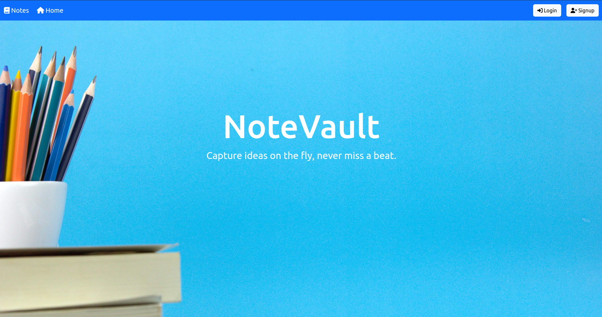
<h1> SignUp Page </h1>
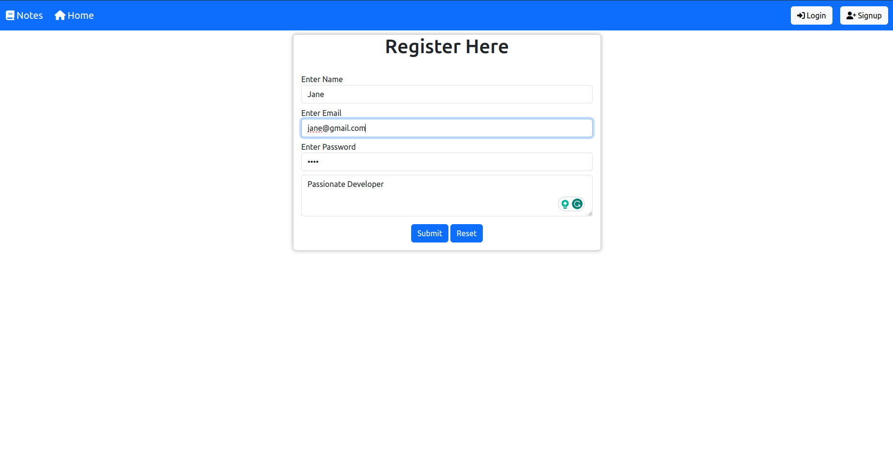
<h1> Login Page </h1>
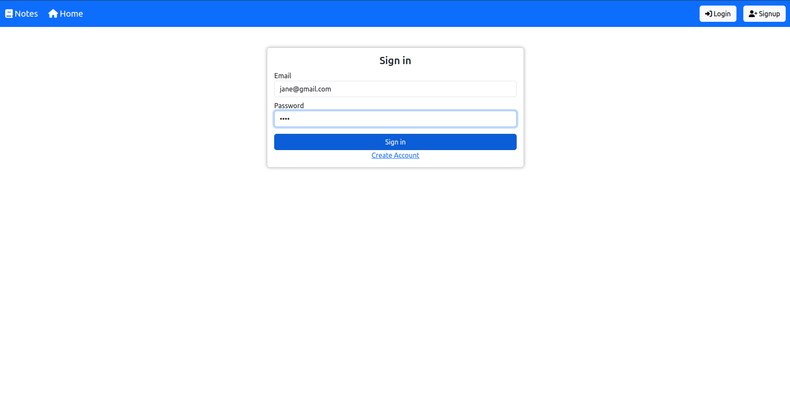
<h1> User's Home Page </h1>
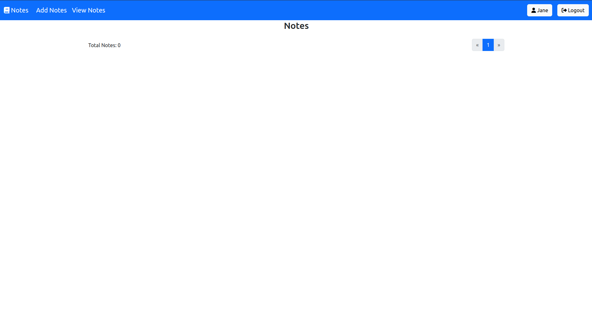
<h1> Add Notes Page </h1>
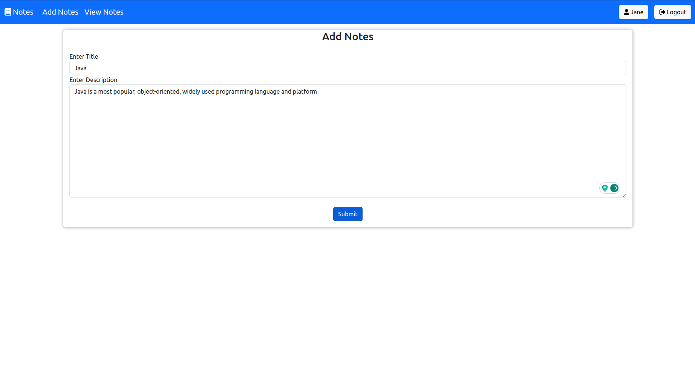
<h1> Added Note </h1>
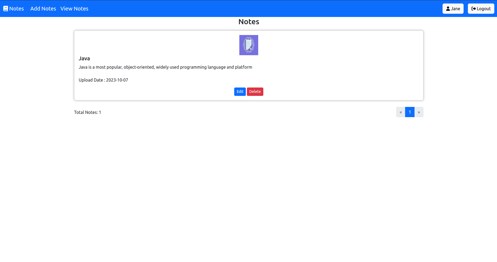
<h1> Edit Notes Page </h1>
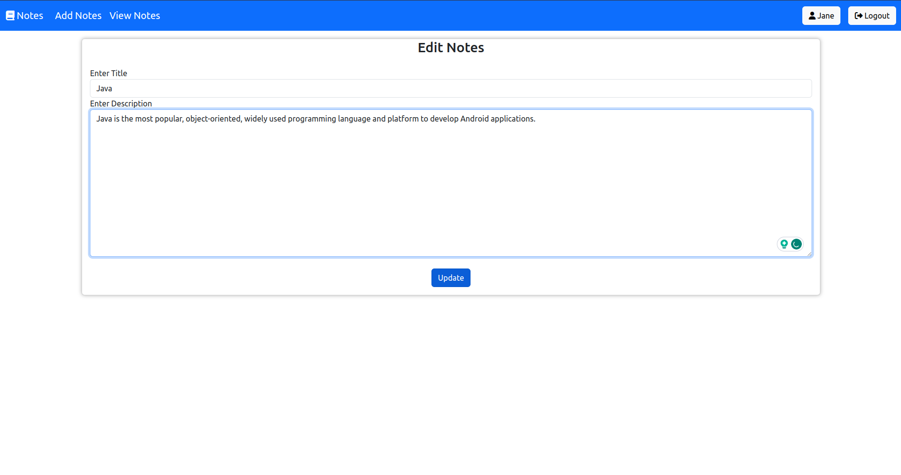
<h1> Updated Note </h1>
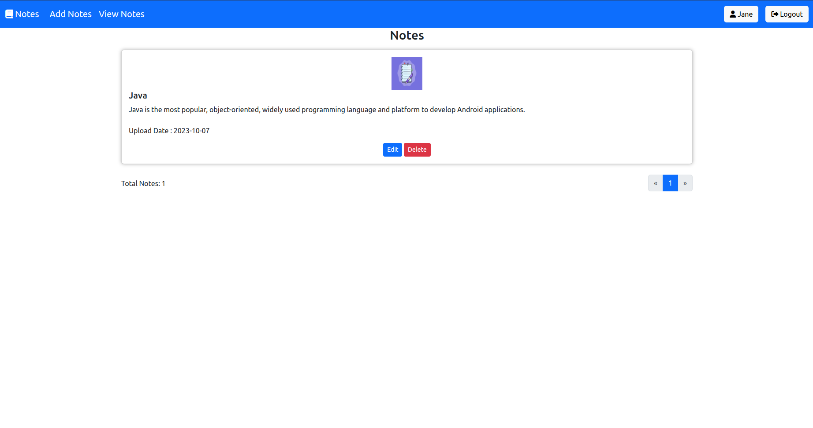
<h1> Profile Page </h1>
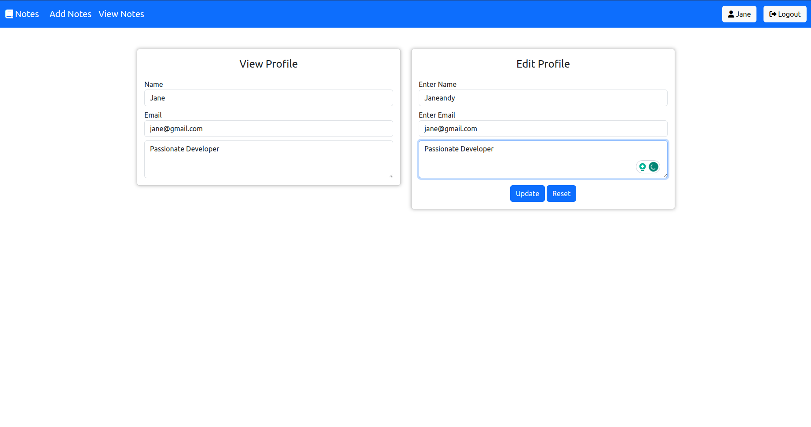
<h1> Updated Profile </h1>
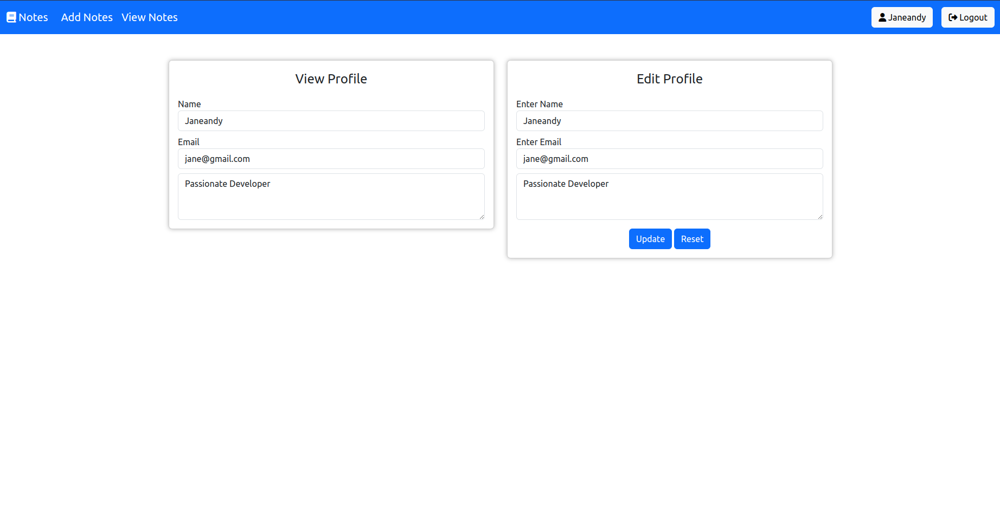
<h1> Logout page </h1>
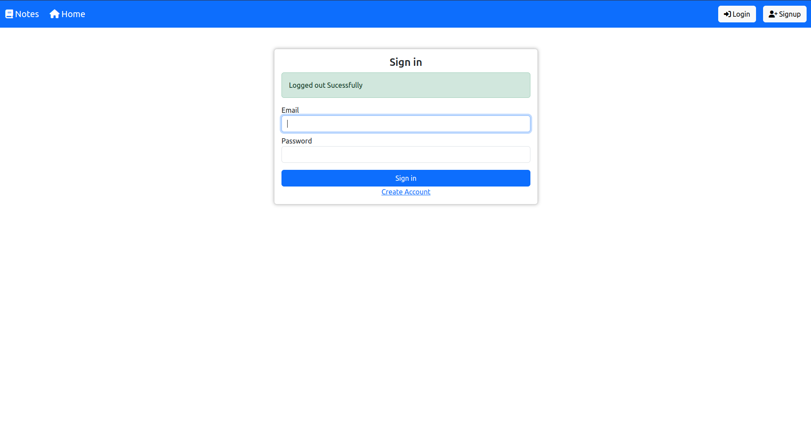